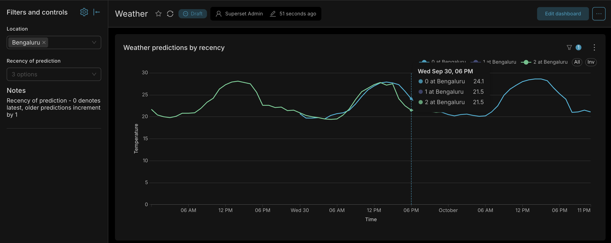

## Intro

This is a simple weather data ELT script that fetches weather predications periodically from the free api from open-meteo

follow the setup below to get your local instance running

## Approach, assumptions, tradeoffs

### Api

i wanted a simple to get started api that can be extended beyond its initial use and the open-meteo api felt like a good choice for a simple poc

this is a free api (with rate limit) and stupid simple, any customization you need can be done via url query params

the script currently fetched temperature predictions for 2 days on every run for Bengaluru but, the script is setup in a way where you just need to add/edit the seed tables and the script takes over the rest - add more locations, add more weather params etc

if you have bruno, you can check the bruno folder otherwise just go to their docs page, its setup very well - supers user friendly to run within the browser and even visualize it - check [Here](https://open-meteo.com/en/docs)

### DBT

i vaguely remember the big v2 shift but assumed uv would add the latest stable and just went ahead, did not realise they released a v2 stable without postgres support! (maybe a large chunk of users use columnar and postgres wasnt a super big priority? i dont know - the ADBC reason is interesting) - anyway this delayed it quite a bit because i assumed setting the experimenatal flag would be enough but it wasnt - after more than a hour trying, i gave up and downgraded back to v1 stable

the irony here is i have asked people to try dbt and watched a lot of videos but never actually did myself, so took this as an excuse to finally do it. before starting, i watched the dbt playlist by [kahan data solutions](https://youtube.com/playlist?list=PLy4OcwImJzBLJzLYxpxaPUmCWp8j1esvT)

this is still a very simplistic use, can definetly be extended much beyond but for now it does these:

1. seeds the api config tables
2. uses the python output table to create staging tables
3. creates a simple final view that can be accessed via the dashboard
4. few data tests are run

### The python data fetch script

This was built almost entirely by mimo 2.6 via claude code - instructions i gave it are in CLAUDE.md

the intention here also was to make it fully automatic - as in take the dbt profiles.yaml so that user does not need to make any changes but some values are currently hardcoded

which profile it picks up can be set in the `.env`

### Limitations

1. although the seeds were meant to be so extensible that any api could eventually be swapped out, due to the poc nature, the script fails if you add another source - hopefully this is easy to extend later on or atleast that was my intention
2. although new params can be added, it only applies to future runs, there is no backfill mechanism yet - out of scope for yhe poc
3. a lot more of tests and specific model level config has been left out from dbt config
4. did not have the energy to figure out a clean way to put current values within the final analytics table - could have made for a nice "how far away were the predictions? or how did the prediction accuracy change as it got closer?" etc

### My general though process

Can be found in `skanda_notes.md`

### AI Use

Metioned in the git commit descriptions, used mainly:
1. mimo 2.6 via claude code (very affordable - yet quite capable)
2. sonnet 5 (free version on the web for specific dbt design inputs)

## Folder structure

./dashboard/ - example superset dashboard
./mad_dbt/ - the dbt project
            models/ - contains the staging and final models
            seeds/ - example api configuration metadata
            tests/ - some basic data checks
./open_meteo_bruno/ - contains a bruno project if you want to run the raw api
./main.py - entrypoint script
./db.py - db connection funcs, creates raw and logging table, auto connects to db usong dbt profiles.yml
./ingest.py - reads the api config from the seeded tables, constructs the request, check rate limit, stores response

## Setup

0. pre-req:
    - `uv` is required to manage and run this project - install from [Here](https://docs.astral.sh/uv/getting-started/installation/)
    - a postgres database, preferrably local
    - You are on a linux/mac machine with bash/zsh terminal. if running from windows try from WSL2 (un-tested)
1. clone to local, use `uv` to initialize the project with `uv sync`
    - make a copy of `.env.example` and rename it `.env`
2. do you already have dbt on your local machine?
    - Yes! - Add a new profile called `mad_dbt_skanda` with the template below
    - No... - copy template below to a file called profiles.yml under `<USER_HOME>/.dbt/`

```
mad_dbt_skanda:
  target: dev
  outputs:
    dev:
      type: postgres
      port: 5432
      database: mad_asmt
      schema: weather
      threads: 10
      host: localhost
      user: postgres
      password: postgres
```

3. Update the user and password to your local postgres - this user should have persmission to create schemas, run any DML etc (basically admin preferred)
4. open a terminal at the root of this repo / open in your ide
    - IDEs usually activate the python env automatically, if not run `source .venv/bin/activate`
5. cd into mad_dbt and run `uv run dbt build`
    - This should seed api related metadata into postgres
    - at this stage you can also view dbt inbuilt docs by running `uv run dbt docs generate && uv run dbt docs serve`
6. now cd back to the root and run `uv run main.py` - this should seed some data (this will also be the script you would schedule)
7. perform step (6) again to update the tables (if dbt_project is changed to view this is not needed but a table/mat_view is faster for a dashboard)
8. Do you have an instance of superset where you can import the example dashboard?
    - Yes!
        - skip to step (9)
    - No - Below is a simple docker based local installation procedure:
        0. pre-req: a local docker installation
        1. clone the superset git repo - `git clone --depth 1 --branch 6.1.0 https://github.com/apache/superset.git` and `cd superset`
        2. Do you just want an instance running or are you keen on maintaing it?
            - Just running - proceed to step (3)
            - Want to maintain it - create a copy of the `image-tag.yml` - in this remove `db:` container, check superset docs to add the python connection string to your pythonpath_dev config.py
        3. bring up the contianers - `docker compose -f docker-compose-image-tag.yml up -d` - this can take a couple of minutes
9. Go to `dashboards` -> import -> choose file `./dashboard/dashboard_export_20260930T125624.zip`
10. under settings -> Datbase Connections - replace the credentials to `PostgreSQL - Local` to the db that dbt created the tables in
11. You can now use the `weather` dashboard
12. Once done run this from the superset folder to turn off the superset container `docker compose -f docker-compose-image-tag.yml down`

## Example dashboard:

